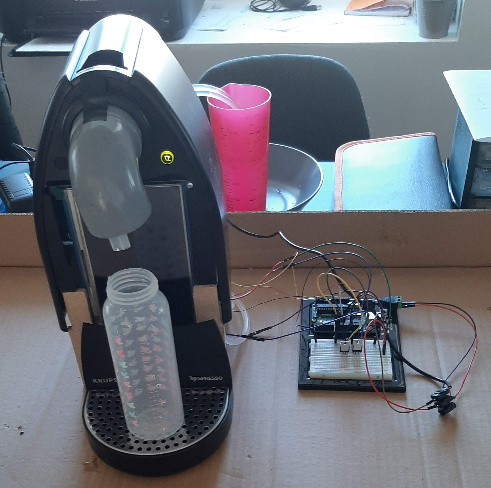

# Autobar - or how robots can be (cocktail) artists too

A mechanical cocktail artist built with pumps and a Raspberry Pi inside an old coffee machine.



Above is a picture of the time when we tested with only two pumps, using a timer to control the dosage.

## Hardware - tips for autobar constructions

### Pumps

The pumps are diaphragm pumps, which can lift both air and liquid. We fitted 10 of them inside an unsued coffee machine, each pump costs about 3,50€.

The characteristics are 4W with 12V and less than 300 mA. It theoretically outputs 800 ml / min ± 100 ml. It can push liquid up to 1,5m, but more importantly pull from 1m, so typically from a bottle on the ground (in a cooler for example) while the machine is on a table.


In my first version, I used aquarium pumps which cannot lift air. The problem was that I needed to suck the air out of the tubes, plus carbonated drinks made bubbles inside the pump which broke the pump's ability to lift liquid. Furthermore the flow was too important and unpredictable, which prohibits fine volume measuring. We also tested a 1.5-2 L/Min 1A diaphragm pump but the flow was kind of too high again, even if it can lift from 2m !

The pumps are controlled from the Raspberry Pi's GPIO by thyristors. They work as controlled switches by connecting the gate to the GPIO without forgetting a pull-down 10kOhm resistor.

Here is a close up, you can almost see the resistor we hid beneath the component linking the gate to the drain (just above the blue shrink).


### Weight sensing

We include a weight module typically used with Arduino to sense how much liquid is poured. The HX711 analog to digital amplifier did not work with the `gpiozero` library, so I kept the classic `RPi.GPIO` with code from [here](https://circuitdigest.com/microcontroller-projects/arduino-weight-measurement-using-load-cell/). The HX711 is a capricious device because the protocol is fast paced, so the `gpiozero` lack of performance was eliminatory. In the file `hardware/weight.py`, we use multithreading to trigger a callback according to a weight condition.

In previous autobar iterations, we found that timing based mixing was unreliable. Too many factors influence the quantity pumped over time : the level inside the bottle, the length and position of the tubes, bends in the tube, if liquid already fills the tube, etc... The current implementation raises a timeout if the weight condition is not fullfilled. Previously, I put off the timeout if the weight was varying (which would imply something is happening, versus an empty bottle), but I removed that since the code is already way too complicated as of now.

### Display and control

We interact we the Autobar using the two original buttons (one green with a built-in LED and coffee cup symbol, one red with power symbol) and a touch screen.

For the touchscreen, we use a capacitive 7inch screen, connected by HDMI and USB. The resolution is 1024x600 pixels. Capacitive screens are more expensive (mine was 64€ at Waveshare) but resistive technology requires the user to push "harder" to interact with the screen.

It is quite crowded in there !


### Power

The Pi uses a 5V 2.5A supply (the bare minimum considering the screen gets power through USB). The pumps supply is separated with a 12V 3A, but 1A would suffice with our pumps. They must share the same ground or the pumps will trigger randomly.

## Software

The Raspberry Pi runs a django server. I wanted a potentially complex database of cocktails, with tables such as Ingredients, Doses, history of Orders, etc. I display my website on the touchscreen, but you could use your smartphone to control your own barmachine. The main point is to use another device to configure the database, especially what is inside the Dispensers. This is were Django shines with the out-of-the-box admin interface.

For a smooth experience, I recommend using a Rapsberry Pi 3 at least. I encountered a lot of WiFi 2.4GHz issues with my Pi 2. The Pi Zero is not suited to use with a touchscreen/desktop.

This is what the website looks like for now :


The database comes from an open source project (I lost the link, I'll find it again later). I ran into the issue of having way too many ingredients in the scraped DB, so I suggest combining several ingredients into one (like all the Schnapps, sorry).

### Setup

Some dependencies, for example for the virtual keyboard.

```bash
sudo apt install at-spi2-core florence unclutter
```

This is what I added to the boot options :

```bash
#LCD Display HDMI Touchscreen Waveshare

max_usb_current=1
hdmi_group=2
hdmi_mode=87
hdmi_cvt 1024 600 60 6 0 0 0
hdmi_drive=1

display_rotate=3 #1: 90; 2: 180; 3: 270
```

And I rotated the touch sensing (see more [here](https://www.waveshare.com/wiki/Template:10.1inch_HDMI_LCD_(B)_Manual)).

This project is Python 3.5+, dependencies are in `requirements.txt`. My Pi is dedicated to the bar so we used the system py3 environment.

### Manual run

```bash
python3 manage.py runserver 0.0.0.0:8000
```

Yes that's Django in debug mode. Not safe to use anywhere else than on your local network.

### Startup run

We need to start the server on startup.

```bash
crontab -e  # to add a cronjob

# Then add

@reboot sleep 1 && /home/pi/autobar/start.sh &  # I found that you do not need to wait to start the server. To stop it, use pkill python in a terminal
```

To open the website on startup in kiosk mode, I followed [this SO answer](https://raspberrypi.stackexchange.com/a/40745). The touchscreen worked better with Chromium, Firefox did not scroll through the page.

```bash
mkdir -p /home/pi/.config/lxsession/LXDE-pi/
cp /etc/xdg/lxsession/LXDE-pi/autostart /home/pi/.config/lxsession/LXDE-pi/autostart

nano /home/pi/.config/lxsession/LXDE-pi/autostart

# I kept the original options except the screensaver

#@xscreensaver -no-splash  # comment this line out to disable screensaver
@xset s off
@xset -dpms
@xset s noblank
# disable mouse with unclutter (TODO: copy from current file)
@chromium-browser --incognito --kiosk http://localhost:8000/  # full screen mode
```

You can use `--kiosk` to hide most messages or `--start-fullscreen` which is less restrictive on its messages to the user.

To exit the kiosk mode, I linked my red button (see `hardware.serving.CocktailArtist.on_red_button`) to kill chromium. I tried to simulate the F11 button with `xdotool` but `killall chromium-browser` just works.

### Wiki

The code separates the concepts of hardware interfacing and user interface. Since Django works in apps, we have on one hand the `recipes` app for the basic Django website, on the other hand the `hardware` app.

Only the `recipes` app has models :


There are two parts, the Configuration is a SingletonModel from our dependency `solo`. I wanted to be able to edit all user experience and parameters from the touchscreen instead of fetching my computer, log in SSH, edit the settings file, restart.

Now for the nice parts, the cocktails. The behaviour we aimed for was to tell the autobar what ingredients we pump from, and for the machine to tell us what it can do from it. So I called `Dispenser`s the pumps in case someone uses another kind of hardware. It links to one of our known `Ingredient`s. `Mix` is the most important table, it stores all the cocktail information. `Dose` represents the composition of a mix, with a precise quantity of an ingredient in a specific order.
Finally, the *Mix me!* button posts an `Order` creation. This way, I had the history of user interactions. The mix's `count` field is thus redundant, but now you can edit it at least.

I tried using the Django forms to properly work with the Orders, but in the end I landed on Ajax for background calls. For example, to display the last Order progress, we spam GET requests to the server for an update. Not the best code, but works perfectly at our scale. The `hardware` app is connected to this database by capturing every `post_save` Order event. The singleton object `CocktailArtist` receives the order object everytime its save method is called. Seems like I really like singletons, but this was necessary to ensure GPIO pins are instanciated only once. The Singleton class is not mine. The life of an Order goes as follows :

1. Order creation from a POST request
1. the Artist catches the creation, and `accepted=True`s if it was not already busy and all ingredients are available. The Artist is now busy and saves the order, so it goes to post_save again
1. Artist sees your order a second time, since it is accepted, it moves it to the *waiting* status. According to your parameters, it could mean waiting to detect the weight of a glass or the user pressing a start button. The Artist saves the order
1. There it is again ! The post_save catches the order again. The Artist is still busy, but it does nothing with the Order
1. At some point, another thread moves the Order to the next status : *serving*. It could be a button press, or a weight module trigger
1. The Order at *serving* is caught by the Artist. According to the `doses_served`, we choose the next `Dose` to execute. If done, passes to *done*

There is a lot of overkill in this project : the ingredient density, doing the median of weight values, ... (to complete has I code more unecessary things)

## Other automatic cocktail machines

(PR to be included)

- (todo)

## TODO

- combine doses of same ingredient (look out for number field)
- no 0.0 quantity for regular ingredients
- eliminate pictures not in DB
- add fixtures with verified mixes
- manually add all mixes with most common alcohol
- set volume to shot (big, small...)
- script to manually verify mix while being prompted with online info
- [use F in queries](https://docs.djangoproject.com/en/2.2/topics/db/queries/#filters-can-reference-fields-on-the-model)
